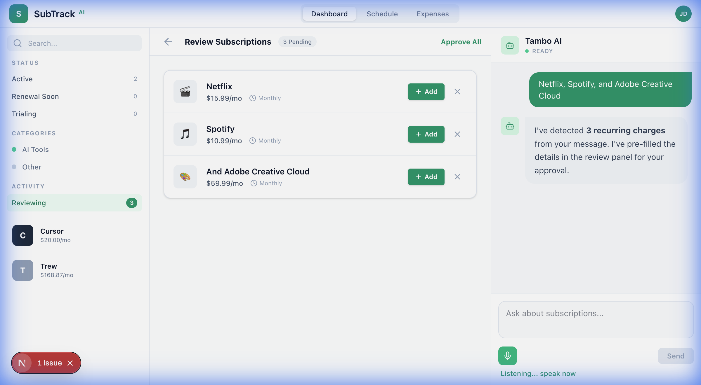
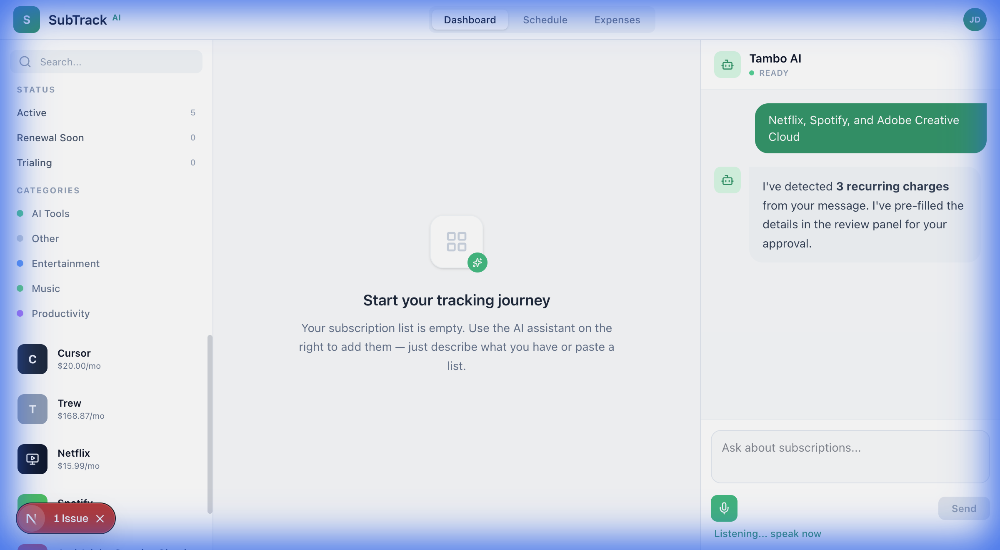
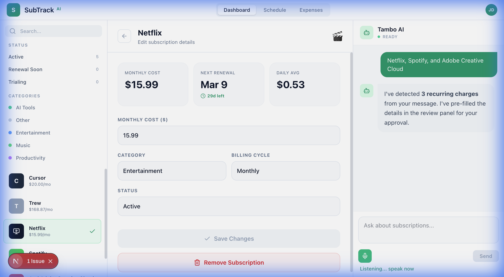

<div align="center">

# 🎯 SubTrack AI

### Stop losing money to forgotten subscriptions

**The AI-powered subscription tracker that actually understands what you're paying for.**

[](https://nextjs.org/)
[](https://www.typescriptlang.org/)
[](https://tambo.dev)

</div>

---

## 🤔 The Problem

> *"Wait, I'm still paying for that?"*
> 
> — Everyone, at some point

We've all been there. You sign up for a free trial, forget to cancel, and suddenly you're paying $15/month for something you never use. Studies show the average person wastes **$200+ per year** on unused subscriptions.

## ✨ The Solution

**SubTrack AI** makes subscription tracking effortless. Just tell it what you're subscribed to in plain English, and it does the rest.

<div align="center">

### 💬 Just chat naturally

*"I have Netflix, Spotify, and Adobe Creative Cloud"*

</div>

That's it. No forms. No spreadsheets. Just a conversation.

---

## 📸 See It In Action

### 1️⃣ AI-Powered Detection
Just type your subscriptions naturally — the AI instantly recognizes them and fills in the details:



### 2️⃣ Smart Dashboard  
All your subscriptions organized in one beautiful interface with categories, costs, and renewal dates:



### 3️⃣ Detailed Insights
Click any subscription to see spending patterns, daily costs, and quick actions:



---

## 🚀 Features

| Feature | Description |
|---------|-------------|
| 🤖 **AI Chat Interface** | Add subscriptions by just talking naturally |
| 🎤 **Voice Input** | Speak your subscriptions — hands-free tracking |
| 📊 **Spending Analytics** | See where your money goes each month |
| 🏷️ **Auto-Categorization** | Entertainment, Productivity, Music — sorted automatically |
| 📅 **Renewal Alerts** | Never be surprised by a charge again |
| 🔍 **Smart Search** | Find any subscription instantly |
| 💰 **Cost Insights** | Track daily, monthly, and yearly spending |

---

## 🛠️ Tech Stack

- **Framework:** [Next.js 16](https://nextjs.org/) with App Router
- **Language:** [TypeScript](https://www.typescriptlang.org/)
- **AI Engine:** [Tambo](https://tambo.dev) — Generative UI framework
- **Styling:** Tailwind CSS with custom design system
- **Icons:** Lucide React

---

## ⚡ Quick Start

### Prerequisites
- Node.js 18+ 
- npm or yarn
- [Tambo API Key](https://tambo.dev) (optional — works in demo mode without it)

### Installation

```bash
# Clone the repo
git clone https://github.com/YOUR_USERNAME/subtrack-ai.git
cd subtrack-ai

# Install dependencies
npm install

# Set up environment (optional)
echo "NEXT_PUBLIC_TAMBO_API_KEY=your_key_here" > .env.local

# Run development server
npm run dev
```

Open [http://localhost:3000](http://localhost:3000) and start tracking! 🎉

---

## 🎮 Try It Out

1. **Tell it your subscriptions:**
   - *"I use Netflix, Spotify, and ChatGPT Plus"*
   - *"Add my Adobe Creative Cloud subscription"*
   
2. **Review and approve** the detected subscriptions

3. **Explore your dashboard** — see spending, categories, and upcoming renewals

4. **Ask questions:**
   - *"How much do I spend on streaming?"*
   - *"What renewals do I have this month?"*

---

## 📁 Project Structure

```
src/
├── app/              # Next.js App Router pages
├── components/       # React components
│   ├── TamboChat.tsx     # AI chat interface
│   ├── MetricCards.tsx   # Dashboard cards
│   └── ...
├── lib/              # Utilities and types
└── contexts/         # React context providers
```

---

## 🤝 Contributing

Contributions welcome! Feel free to:
- 🐛 Report bugs
- 💡 Suggest features
- 🔧 Submit PRs

---

## 📄 License

MIT © 2025

---

<div align="center">

**Built with ❤️ for the [Tambo](https://tambo.dev) Hackathon**

*Stop overpaying. Start tracking.*

</div>
